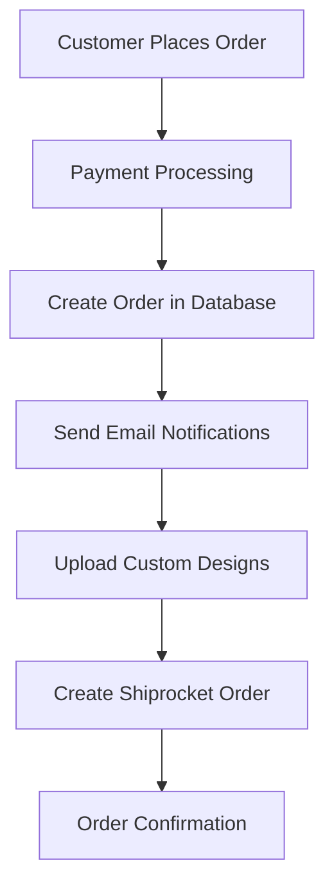
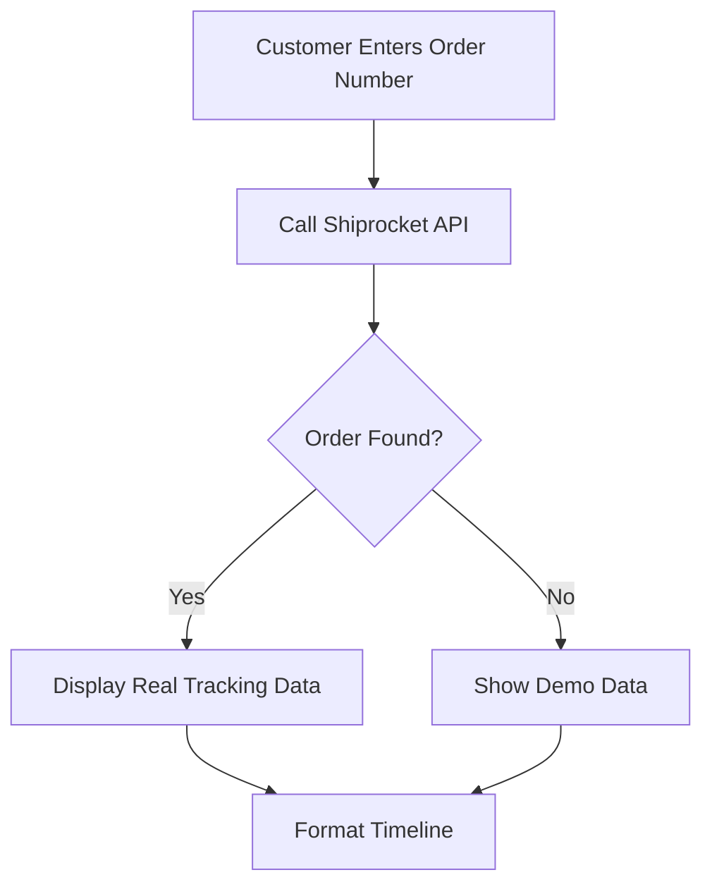

# Shiprocket Integration Guide

This document outlines the complete Shiprocket integration for order management and tracking in the Lunarz e-commerce platform.

## Overview

Shiprocket is integrated to handle:
- Automatic order creation when customers place orders
- Real-time order tracking
- Shipping cost calculation
- Courier partner management
- AWB (Air Waybill) generation

## Setup Instructions

### 1. Shiprocket Account Setup

1. **Sign up at [Shiprocket](https://shiprocket.in/)**
2. **Complete seller onboarding** with business details
3. **Set up pickup locations** in your Shiprocket dashboard
4. **Get your login credentials** (email and password)

### 2. Environment Configuration

Add the following to your `.env.local` file:

```env
# Shiprocket Configuration
SHIPROCKET_EMAIL=your-shiprocket-email@example.com
SHIPROCKET_PASSWORD=your-shiprocket-password
```

### 3. Pickup Location Setup

In your Shiprocket dashboard:
1. Go to **Settings > Pickup Locations**
2. Add your warehouse/store address
3. Set the default pickup location name (used in API calls)

## Integration Components

### 1. Shiprocket Service (`lib/shiprocket-service.ts`)

Core service class that handles:
- Authentication with Shiprocket API
- Order creation and management
- Order tracking
- Data formatting between systems

**Key Methods:**
- `authenticate()` - Get auth token
- `createOrder()` - Create order in Shiprocket
- `trackOrder()` - Track order by AWB/Order ID
- `formatOrderForShiprocket()` - Convert order data
- `formatTrackingData()` - Format tracking response

### 2. API Routes

#### Create Order Route (`app/api/shiprocket/create-order/route.ts`)
- **Endpoint:** `POST /api/shiprocket/create-order`
- **Purpose:** Create orders in Shiprocket system
- **Called:** After successful payment/order confirmation

#### Track Order Route (`app/api/shiprocket/track-order/route.ts`)
- **Endpoint:** `GET /api/shiprocket/track-order`
- **Parameters:** `awb_code` or `order_id`
- **Purpose:** Get real-time tracking information

### 3. Checkout Integration (`app/checkout/page.tsx`)

The checkout process now includes:
1. Order creation in local database
2. Email notifications
3. Custom design uploads to Google Drive
4. **Shiprocket order creation** (new)

**Flow:**
```
Order Placed → Local DB → Emails → Google Drive → Shiprocket → Success
```

### 4. Order Tracking (`app/track-order/page.tsx`)

Enhanced tracking page that:
1. First tries to get real data from Shiprocket
2. Falls back to mock data for demo purposes
3. Displays comprehensive tracking timeline

## Data Flow

### Order Creation Flow



### Order Tracking Flow



## Order Data Mapping

### From Lunarz to Shiprocket

| Lunarz Field | Shiprocket Field | Notes |
|--------------|------------------|-------|
| `orderId` | `order_id` | Unique order identifier |
| `customerInfo.firstName` | `billing_customer_name` | Customer first name |
| `customerInfo.lastName` | `billing_last_name` | Customer last name |
| `shippingAddress.address` | `billing_address` | Full address |
| `shippingAddress.city` | `billing_city` | City name |
| `shippingAddress.pincode` | `billing_pincode` | PIN code |
| `items` | `order_items` | Product details array |
| `paymentMethod` | `payment_method` | COD/Prepaid |
| `totalAmount` | `sub_total` | Order total |

### Product Item Mapping

| Lunarz Field | Shiprocket Field | Default Value |
|--------------|------------------|---------------|
| `product.name` | `name` | Product name |
| `product.sku` | `sku` | Product ID if no SKU |
| `quantity` | `units` | Item quantity |
| `product.price` | `selling_price` | Item price |
| - | `hsn` | 61091000 (T-shirt HSN) |

## Error Handling

### Graceful Degradation

The integration is designed to not fail the main order process:

1. **Order Creation:** If Shiprocket fails, order still completes
2. **Tracking:** Falls back to demo data if API unavailable
3. **Logging:** All errors logged for debugging

### Common Issues

1. **Authentication Failures**
   - Check credentials in `.env.local`
   - Verify Shiprocket account status

2. **Order Creation Failures**
   - Validate pickup location setup
   - Check required field mapping

3. **Tracking Issues**
   - Ensure AWB codes are generated
   - Verify order exists in Shiprocket

## Testing

### Test Order Creation

1. Place a test order through checkout
2. Check browser console for Shiprocket logs
3. Verify order appears in Shiprocket dashboard

### Test Order Tracking

1. Use demo order number: `LNZ240001`
2. Or use real AWB code from Shiprocket
3. Verify tracking timeline displays correctly

## Production Considerations

### Security

- Store credentials securely in environment variables
- Use HTTPS for all API communications
- Validate all input data before API calls

### Performance

- Implement retry logic for failed API calls
- Cache authentication tokens (24-hour expiry)
- Use background jobs for non-critical operations

### Monitoring

- Log all Shiprocket API interactions
- Monitor order creation success rates
- Set up alerts for API failures

## Future Enhancements

1. **Webhook Integration**
   - Receive real-time status updates
   - Automatic status synchronization

2. **Bulk Operations**
   - Bulk order processing
   - Batch status updates

3. **Advanced Features**
   - Return/exchange handling
   - Multi-courier selection
   - Shipping cost optimization

## Support

For Shiprocket-related issues:
- **Shiprocket Support:** [support@shiprocket.in](mailto:support@shiprocket.in)
- **API Documentation:** [Shiprocket API Docs](https://apidocs.shiprocket.in/)
- **Dashboard:** [Shiprocket Dashboard](https://app.shiprocket.in/)

## API Endpoints Reference

### Authentication
```
POST https://apiv2.shiprocket.in/v1/external/auth/login
```

### Create Order
```
POST https://apiv2.shiprocket.in/v1/external/orders/create/adhoc
```

### Track Order
```
GET https://apiv2.shiprocket.in/v1/external/courier/track?awb_code={awb}
GET https://apiv2.shiprocket.in/v1/external/courier/track?order_id={order_id}
```

### Get Orders
```
GET https://apiv2.shiprocket.in/v1/external/orders?page={page}&per_page={per_page}
```

---

**Note:** This integration provides a robust foundation for order management and tracking. The system is designed to be resilient and will continue to function even if Shiprocket services are temporarily unavailable.